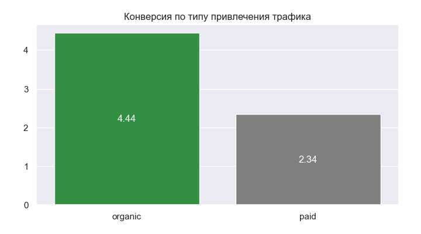
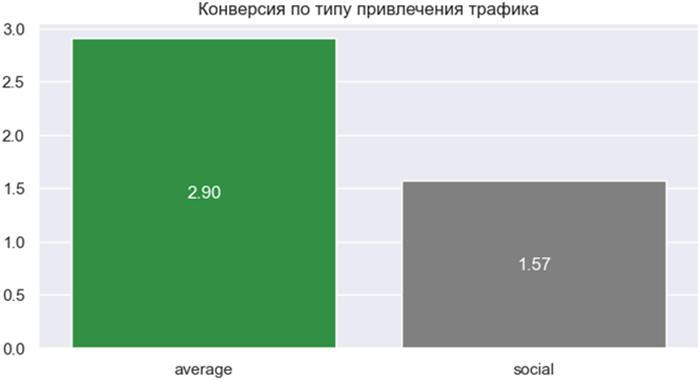

# Гипотезы по конверсии

[Notebook](subscription_data.ipynb) · учебный кейс, подписка на автомобили

**Стек:** Python, Pandas, NumPy, SciPy, Statsmodels, Seaborn, Matplotlib

Продуктовая команда сформулировала гипотезы про CR и ряд вопросов по трафику. На данных Google Analytics проверил, где конверсия реально отличается, и что стоит усиливать в привлечении.

Apple, Samsung и Xiaomi в этом кейсе — бренды устройств в хитах. Skoda, Lada и Toyota — модели автомобилей.

## Результат

Проверил гипотезы о равенстве CR — во всех трёх сравнениях различие статистически значимо (z-тест пропорций):

| Сравнение | CR | Вывод |
|---|---|---|
| Органика vs платный | **4.44%** vs 2.34% | органика выше ≈ на 90% |
| Desktop vs mobile | **3.32%** vs 2.8% | desktop выше ≈ на 19% |
| Москва/СПб vs регионы | **2.99%** vs 2.9% | столицы чуть выше (~3%) |

## Ответы продукту

- **Объём целевых действий по брендам устройств:** Apple, Samsung, Xiaomi · **лучший CR:** Samsung, Oppo, Vivo
- **Города по объёму:** Москва, СПб · **лучший CR:** Казань, Краснодар, Уфа
- **Популярные модели авто:** Skoda Rapid, Lada Vesta, VW Polo · **лучший CR:** Toyota Camry, Kia Rio, Kia Seltos
- **Соцсети:** CR 1.6% ниже среднего (2.9%) — наращивать бюджет без доработки канала рано

## Что сделано

1. Z-тесты гипотез по CR (органика/платный, mobile/desktop, столицы/регионы)
2. Разрез целевого трафика по устройствам, городам и моделям авто
3. Сравнение соцсетей со средним CR сайта

## Данные

Учебный датасет GA Sessions и GA Hits: визиты, каналы, устройства, события. Файлы в репозиторий не входят, расчёт и графики сохранены в ноутбуке.

## Вывод

Сильнее всего отличаются органика и desktop. Разница столиц значима, но мала для пересборки бюджета. Для роста имеет смысл опираться на бренды устройств и модели авто с высоким CR и не масштабировать слабые каналы вслепую.
