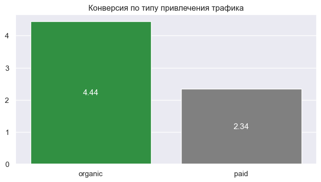
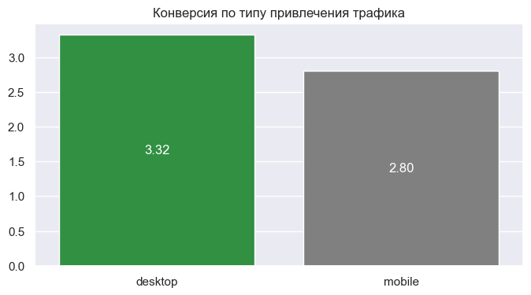
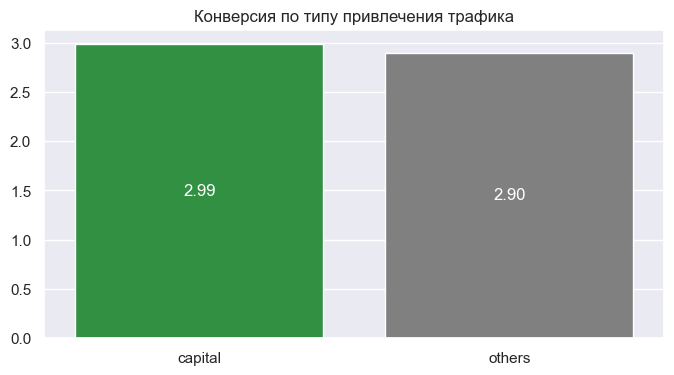

# Анализ данных для сервиса подписки на автомобили

[Код проекта в jupyter notebook](subscription_data.ipynb)

`python` `pandas` `matplotlib` `scipy` `seaborn` `numpy` `statsmodels`

## Цель проекта

Необходимо было проверить гипотезы, сформулированные продуктовой командой, а также ответить на ряд вопросов о действиях клиентов на сайте, что поможет в дальнейшем улучшить качество обслуживания.

**Гипотезы**:

* Органический трафик ничем не отличается от платного по показателю CR (конверсии) в целевые события.
* Трафик с мобильных устройств ничем не отличается от трафика с десктопных устройств по показателю CR (конверсии) в целевые события.
* Трафик из городов присутствия (Москва и область, Санкт-Петербург) не отличается от трафика из других регионов по показателю CR (конверсии) в целевые события.
  
**Вопросы продуктовой команды**:

* Из каких источников/кампаний/устройств/локаций к нам приходит самый целевой трафик (как по объему трафика, так и по CR)?
* Какие автомобили пользуются наибольшим спросом? Какие автомобили имеют лучший CR в целевых событиях?
* Стоит ли нам увеличить свое присутствие в социальных сетях и давать там больше рекламы?

## Описание проекта

Использовались данные Google Analytics. Файл GA Sessions содержит информацию о посещениях сайта, такую как идентификатор посетителя, дату посещения, время посещения, канал привлечения и т. д. Файл GA Hits содержит информацию о действиях посетителя, например: дату события, время события, тип события и и т. д.

## Результат

### Проверка гипотез

Органический трафик статистически значимо отличается от платного с точки зрения CR:

Трафик с мобильных устройств значимо отличается от трафика с десктопных устройств с точки зрения CR:

Трафик из городов присутствия (Москва и область, Санкт-Петербург) значимо отличается от трафика из иных регионов с точки зрения CR

### Ответы на вопросы продуктовой команды

**Из каких источников к нам идет самый целевой трафик с точки зрения объема трафика и с точки зрения конверсии?**

Целевой трафик по устройствам с точки зрения объема:

C точки зрения конверсии:

Целевой трафик по городам с точки зрения объема:

С точки зрения конверсии:

**Какие авто пользуются наибольшим спросом? У каких авто самый лучший показатель конверсии?**

Целевой трафик по модели авто с точки зрения объема:

С точки зрения конверсии:

**Стоит ли нам увеличивать свое присутствие в соцсетях и давать там больше рекламы?**
Не стоит т.к. показатель конверсии 1.6% ниже среднего (2.9%).

## Вывод

На основе проведенного анализа данных Google Analytics были проверены три ключевые гипотезы относительно различий в показателях конверсии (CR) между различными сегментами пользователей. Все три гипотезы оказались неверными:

1. **Органический трафик действительно отличается от платного по показателю CR**: конверсия у органического трафика оказалась выше, чем у платного.

2. **Трафик с мобильных устройств отличается от трафика с десктопных устройств по показателю CR**: пользователи, приходящие через десктопные устройства, демонстрируют более высокую конверсию, чем те, кто использует мобильные устройства.

3. **Трафик из городов присутствия (Москва и область, Санкт-Петербург) отличается от трафика из других регионов по показателю CR**: жители Москвы и Санкт-Петербурга показывают большую конверсию по сравнению с пользователями из остальных регионов.

Кроме того, анализ позволил ответить на несколько ключевых вопросов продуктовой команды:

* **Источники самого целевого трафика**: Наибольший трафик поступает с устройств выпущенных под брендом Apple, Samsung, Xiaomi. С точки зрения конверсии это бренды Samsung, Oppo, Vivo.

* **Самые популярные автомобили и их показатели CR**: Наибольшей популярностью среди посетителей пользуется Skoda Rapid, Lada Vesta и Volkswagen Polo, однако самая высокая конверсия наблюдается у моделей Toyota Camry, Kia Rio и Kia Seltos.

* **Рекомендации по увеличению присутствия в социальных сетях**: Увеличение активности в социальных сетях вряд ли оправдано, поскольку текущая конверсия этого канала ниже средней по сайту.

Таким образом, результаты анализа указывают на необходимость сосредоточиться на улучшении работы с органическим трафиком и мобильными устройствами, а также на развитие кампаний, ориентированных на регионы Москвы и Санкт-Петербурга. В то же время, следует пересмотреть стратегию продвижения в социальных сетях, чтобы повысить эффективность этих каналов.
