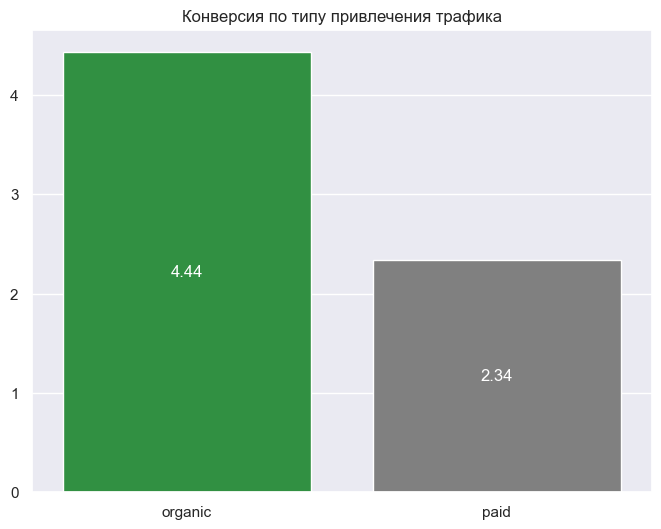
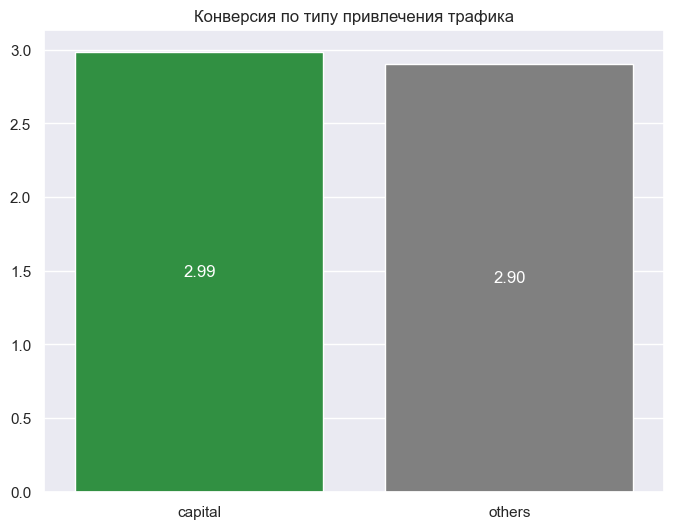
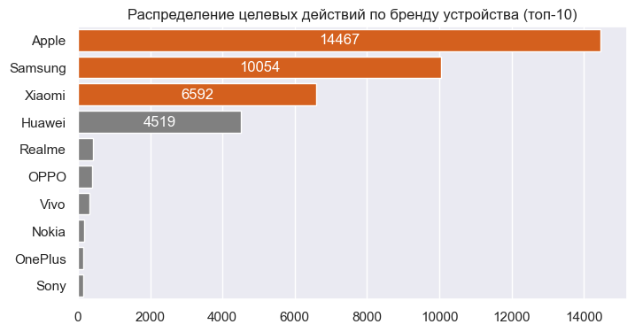
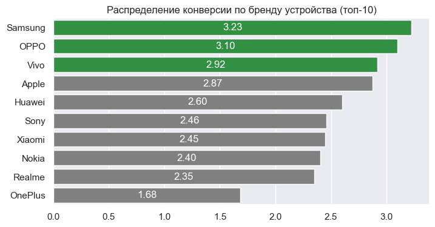
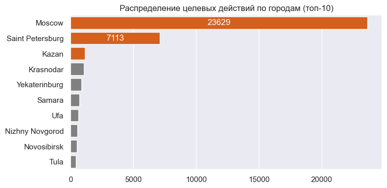
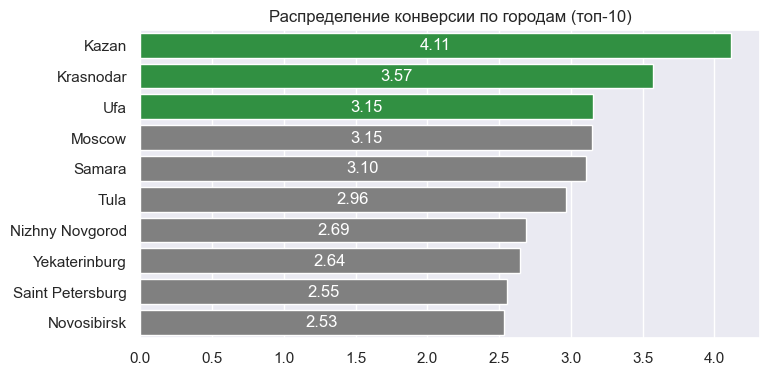
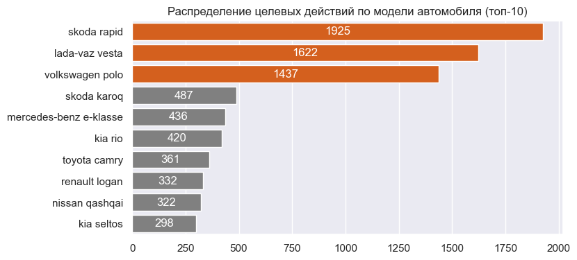
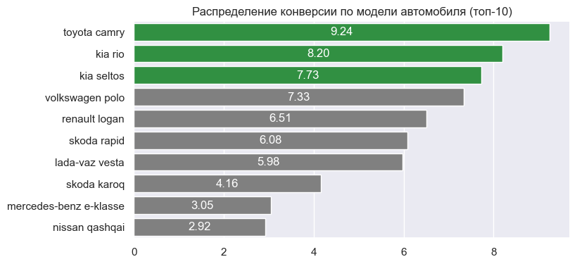
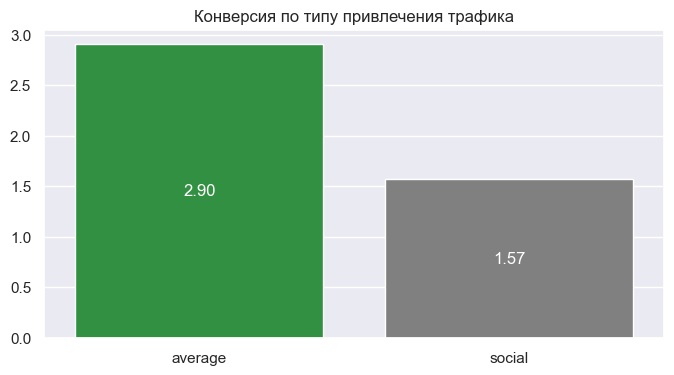

# 🚗Анализ данных для сервиса подписки на автомобили

[Код проекта в jupyter notebook](subscription_data.ipynb)

`python` `pandas` `matplotlib` `scipy` `seaborn` `numpy` `statsmodels`

## Цель проекта

Необходимо было проверить гипотезы, сформулированные продуктовой командой, а также ответить на ряд вопросов о действиях клиентов на сайте, что поможет в дальнейшем улучшить качество обслуживания.

**Гипотезы**:

* Органический трафик ничем не отличается от платного по показателю CR (конверсии) в целевые события.
* Трафик с мобильных устройств ничем не отличается от трафика с десктопных устройств по показателю CR (конверсии) в целевые события.
* Трафик из городов присутствия (Москва и область, Санкт-Петербург) не отличается от трафика из других регионов по показателю CR (конверсии) в целевые события.
  
**Вопросы продуктовой команды**:

* Из каких источников/кампаний/устройств/локаций к нам приходит самый целевой трафик (как по объему трафика, так и по CR)?
* Какие автомобили пользуются наибольшим спросом? Какие автомобили имеют лучший CR в целевых событиях?
* Стоит ли нам увеличить свое присутствие в социальных сетях и давать там больше рекламы?

## Описание проекта

Использовались данные Google Analytics. Файл GA Sessions содержит информацию о посещениях сайта, такую как идентификатор посетителя, дату посещения, время посещения, канал привлечения и т. д. Файл GA Hits содержит информацию о действиях посетителя, например: дату события, время события, тип события и и т. д.

## Результат

### Проверка гипотез

Проверка гипотез осуществлялась с помощью z-теста для пропорций.

```python
count = np.array([m1, m2])
nobs = np.array([n1, n2])
_ , pval = proportions_ztest(count, nobs)
```

По результатом проверки первой гипотезы было получено подтверждение того, что органический трафик статистически значимо отличается от платного с точки зрения CR. Конверсия платного трафика 2.34%, в то же время конверсия платного трафика 4.44%, что на 90% больше.



Проверка второй гипотезы показала, что трафик с мобильных устройств значимо отличается от трафика с десктопных устройств с точки зрения конверсии. Конверсия в целевые события с мобильных устройств 2.8%, а конверсия с десктопных устройств 3.32%, на 19% больше чем у мобильных устройств.


Трафик из городов присутствия (Москва и область, Санкт-Петербург) также статистически значимо отличается от трафика из иных регионов с точки зрения конверсии. Разница в данном случае менее значительная, конверсия в Москве и Санкт-Петербурге 2.99%, в других городах 2.9%, что дает нам разницу показателей всего в 3%.



### Ответы на вопросы продуктовой команды

**Из каких источников к нам идет самый целевой трафик с точки зрения объема трафика и с точки зрения конверсии?**

Если рассматривать целевой трафик по устройствам с точки зрения объема, то больше всего целевых действий совершили клиенты с устройствами Apple, Samsung и Xiaomi.



Наибольшую конверсию в целевое действие показали клиенты, которые пользуются устройствами Samsung, Oppo и Vivo.



Наибольший количество целевых действий по городам ожидаемо показали Москва и Санкт-Петербург



Лучшую конверсию в целевые действия по городам показали Казань, Краснодар и Уфа.



**Какие авто пользуются наибольшим спросом? У каких авто самый лучший показатель конверсии?**

Целевой трафик по модели авто с точки зрения объема:



С точки зрения конверсии:



**Стоит ли нам увеличивать свое присутствие в соцсетях и давать там больше рекламы?**
Не стоит т.к. показатель конверсии 1.6% ниже среднего (2.9%).



## Вывод

На основе проведенного анализа данных Google Analytics были проверены три ключевые гипотезы относительно различий в показателях конверсии (CR) между различными сегментами пользователей. Все три гипотезы показали статистически значимую разницу:

1. **Органический трафик действительно отличается от платного по показателю CR**: конверсия у органического трафика оказалась выше, чем у платного.

2. **Трафик с мобильных устройств отличается от трафика с десктопных устройств по показателю CR**: пользователи, приходящие через десктопные устройства, демонстрируют более высокую конверсию, чем те, кто использует мобильные устройства.

3. **Трафик из городов присутствия (Москва и область, Санкт-Петербург) отличается от трафика из других регионов по показателю CR**: жители Москвы и Санкт-Петербурга показывают большую конверсию по сравнению с пользователями из остальных регионов.

Кроме того, анализ позволил ответить на несколько ключевых вопросов продуктовой команды:

* **Источники самого целевого трафика**: Наибольший трафик поступает с устройств выпущенных под брендом Apple, Samsung, Xiaomi. С точки зрения конверсии это бренды Samsung, Oppo, Vivo.

* **Самые популярные автомобили и их показатели CR**: Наибольшей популярностью среди посетителей пользуется Skoda Rapid, Lada Vesta и Volkswagen Polo, однако самая высокая конверсия наблюдается у моделей Toyota Camry, Kia Rio и Kia Seltos.

* **Рекомендации по увеличению присутствия в социальных сетях**: Увеличение активности в социальных сетях вряд ли оправдано, поскольку текущая конверсия этого канала ниже средней по сайту.

Таким образом, результаты анализа указывают на необходимость сосредоточиться на улучшении работы с органическим трафиком и мобильными устройствами, а также на развитие кампаний, ориентированных на регионы Москвы и Санкт-Петербурга. В то же время, следует пересмотреть стратегию продвижения в социальных сетях, чтобы повысить эффективность этих каналов.
