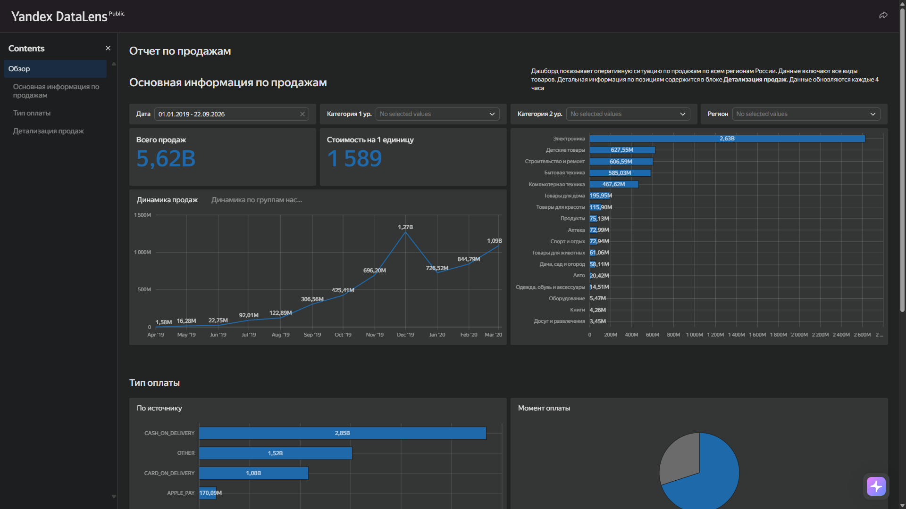
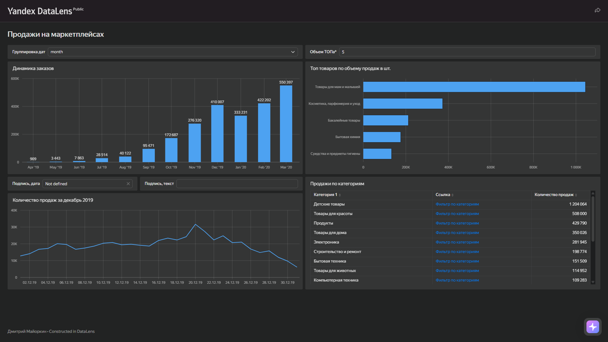
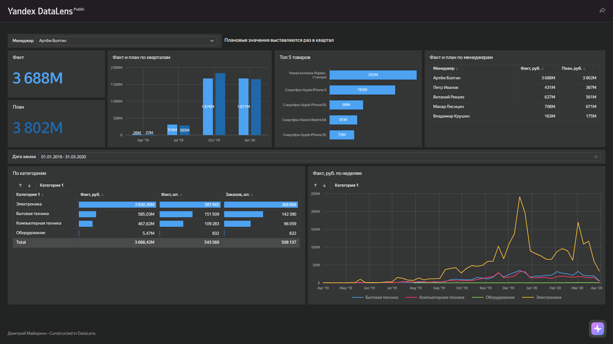

# Дашборды DataLens

[Продажи на маркетплейсах](https://datalens.yandex/40rp1h6ei5g4q?_share_link=public) · [Категорийные менеджеры](https://datalens.yandex/3wccqwhti1wqp?_share_link=public) · [Отчет по продажам](https://datalens.yandex/unm6r32rje2og?_share_link=public) · Учебный кейс · Маркетплейс

**Стек:** Yandex DataLens

Три публичных дашборда по продажам маркетплейса: операционная картина, выполнение категорийных менеджеров и детальный отчёт. Нужно было быстро видеть объёмы, выполнение плана и структуру продаж по категориям, оплатам и статусам.

## Результат

- Всего продаж ~**5,62 млрд** ₽; стоимость на 1 единицу ≈ **1 589** ₽
- План ~**5,60 млрд** / факт ~**5,62 млрд** — план выполнен
- По выручке лидирует **Электроника** (~**2,63 млрд**), по штукам — **Детские товары** (~**1,2 млн**)
- Оплаты: **CASH_ON_DELIVERY** доминирует; статусы: DELIVERED ≈ **1,80 млн**, CANCELLED ≈ **0,54 млн**

## Что сделано

1. **Продажи на маркетплейсах** — динамика заказов, топ товаров по объёму, срез за декабрь и таблица по категориям
2. **Категорийные менеджеры** — факт vs план по кварталам и менеджерам, топ SKU, разрез по категориям и недельная динамика
3. **Отчет по продажам** — KPI, динамика выручки, структура по категориям и типам оплаты, статусы заказов

## Данные

Учебный датасет маркетплейса: апрель 2019 — март 2020. Заказы, категории, менеджеры, оплаты и статусы. Исходные файлы в репозиторий не входят; дашборды доступны по публичным ссылкам выше.

## Вывод

Операционный контур закрыт тремя дашбордами: общий объём и структура, контроль плана по менеджерам и детализация оплат/статусов. Для роста выручки опорная категория — электроника; для объёма в штуках — детские товары. Имеет смысл отдельно разбирать CANCELLED (~0,54 млн) и долю CASH_ON_DELIVERY в структуре оплат.
