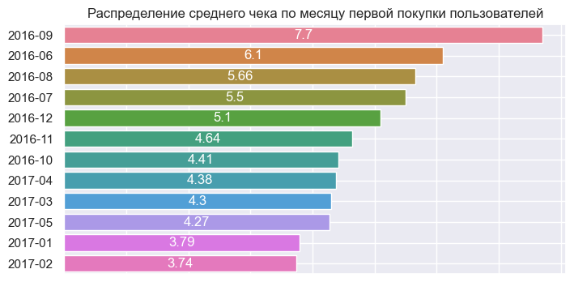
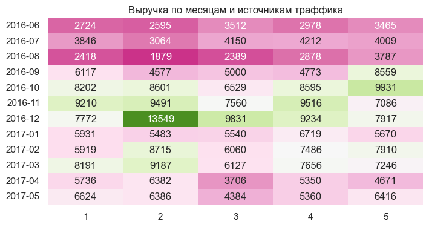
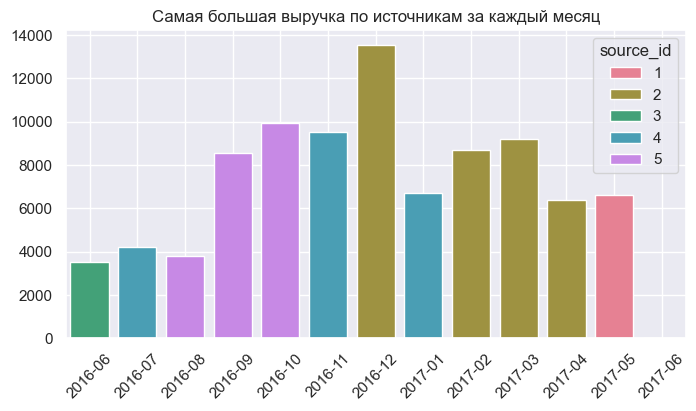
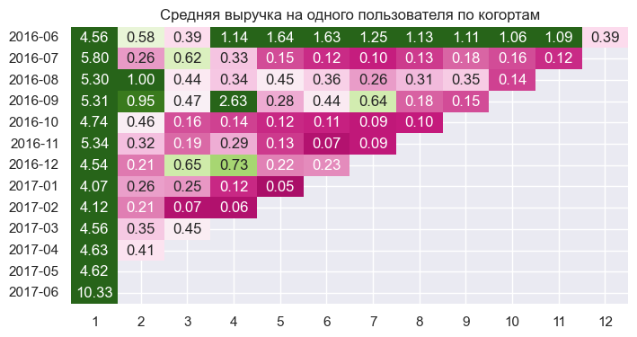
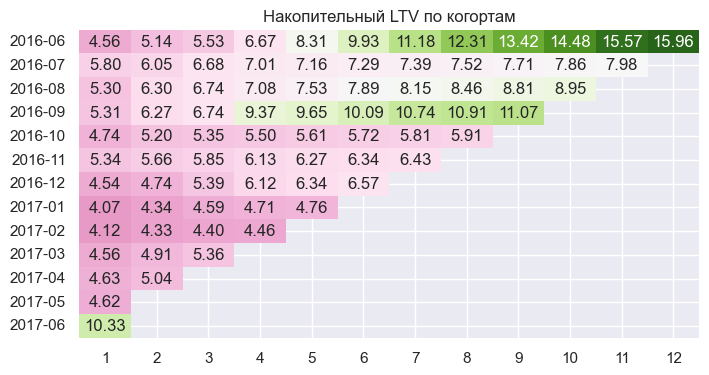
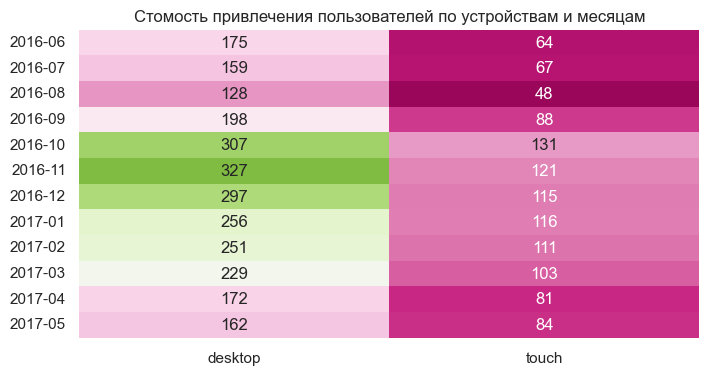
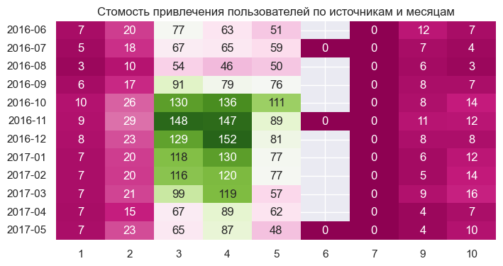

# 💰Анализ данных для финансовой компании

[Код проекта в jupyter notebook](analysis.ipynb)

`python` `pandas` `seaborn` `matplotlib` `numpy` `janitor`

## Цель проекта

Цель проекта заключается в анализе поведения различных групп пользователей для оптимизации маркетинговых стратегий и повышения эффективности работы компании. В рамках этого анализа будут рассмотрены следующие аспекты:

- Анализ среднего чека: Определение того, какие группы пользователей (когорты по месяцу первой покупки) приносят наибольший и наименьший средний чек, чтобы выявить наиболее перспективных клиентов.
- Доход от источников трафика: Анализ дохода по источникам трафика (source_id), с учетом того, что покупка относится к последнему источнику перед совершением транзакции. Это позволит оценить эффективность каждого канала привлечения клиентов.
- LTV-анализ: Расчет жизненного цикла ценности (LTV) каждой когорты пользователей, что поможет понять долгосрочную ценность разных сегментов аудитории.
- Выявление аномалий в трафике: Поиск возможных отклонений в поведении пользователей, которые могут указывать на проблемы с рекламными кампаниями или другими аспектами маркетинга.
- Расходы на трафик: Оценка затрат на привлечение новых уникальных пользователей, включая ежемесячные расходы на трафик по каждому устройству и источнику (source_id).
Этот отчет предоставит комплексную картину о работе компании с точки зрения привлечения и удержания клиентов, а также позволит принимать обоснованные решения относительно распределения бюджета на маркетинговые активности.

## Описание проекта

Есть два набора данных: визиты пользователей на сервис и данные по покупкам. У каждого визита есть источник, а также устройство, с которого заходил пользователь.

- Данные о покупках пользователя, которые находятся в файле purchases, содержат следующие столбцы:
  - buy_ts — дата и время покупки
  - uid — идентификатор пользователя
  - revenue — доход в у.е
  
- Данные о посещениях пользователя visits, со следующими признаками:
  - start_dt — дата старта визита
  - start_ts — дата и время старта визита
  - end_ts — дата окончания визита
  - uid — идентификатор пользователя
  - source_id — id источника визита
  - device — устройство
  - buy_ts — дата и время покупки

## Результат

### Анализ среднего чека

По результам анализа было выявлено, что наибольший средний чек у пользователей которые совершили первую покупку в сентябре 2016 года, наименьший у пользоватлей совершивших первую покупку в феврале 2017 года.

### Доход от источников трафика

Была создана таблица с выручкой по месяцам и источникам трафика, для более наглядной визуализации удален июнь 2017 года т.к. данных за этот месяц недостаточно, а также  7,9 и 10 источник трафика, т.к. они генерируют относительно небольшую выручку.

Эти данные показывают, что с июня по сентябрь выручка снижена по всем источникам трафика, а с октября по декабрь происходит значительный рост выручки.

Также была создана гистограмма, которая демонстрирует максимальную выручку по источникам трафика за месяц.

В данном случае видно, что чаще всего наибольшую выручку за месяц получали второй, пятый и четвертый источники.

|    Месяц   |  Источник |   Выручка |
|------------|-----------|-----------|
| 2016-06    |         3 |   3512.53 |
| 2016-07    |         4 |   4212.67 |
| 2016-08    |         5 |   3787.48 |
| 2016-09    |         5 |   8559.89 |
| 2016-10    |         5 |   9931.30 |
| 2016-11    |         4 |   9516.56 |
| 2016-12    |         2 |  13549.65 |
| 2017-01    |         4 |   6719.20 |
| 2017-02    |         2 |   8715.06 |
| 2017-03    |         2 |   9187.05 |
| 2017-04    |         2 |   6382.92 |
| 2017-05    |         1 |   6624.96 |
| 2017-06    |         4 |     32.50 |

### LTV-анализ

Для того, чтобы найти LTV каждого пользователя по когортам, был произведен расчет средней выручки на одного пользователя, которая сегментирована по месяцу первой покупки и по количество месяцев использования сервиса.

Далее рассчитана накопительная средняя выручка по когортам, что является одним из способов рассчета LTV.

Клиенты совершившие первую покупку в июне и сентябре 2016 года, имеют наибольший накопленный LTV, что может свидетельствовать об эффективности маркетинговых кампаний за этот период.

### Выявление аномалий в трафике

Медианная сумма чека по собранным данным составляет 2 доллара 57 центов, при этом есть один чек на сумму около 2500 долларов и несколько чеков с покупкой больше 500 долларов. Что может свидетельствовать о наличии ошибок в данных.

Такая же ситуация с общей выручкой по клиентам, есть несколько клиентов у которых общая сумма покупок больше 8000 долларов, хотя медианная выручка на одного платящего пользователя 2 доллара 93 цента.
Один клиент принес 3 процента всей выручки, а 15% пользователей 100% выручки. Необходимо получить больше информации о клиентах и особенностях бизнеса, чтобы выявить причины возникновения данных аномалий.

### Расходы на трафик

Десктопные устройства привлекают значительно больше клиентов чем мобильные устройства, соответственно и затраты на трафик выше.

Если рассматривать расходы по источникам трафика, то в данном случае доминируют 3, 4 и 5 источники.

## Вывод

На основании проведенного анализа можно сделать несколько ключевых выводов:

1. **Анализ среднего чека** показал, что пользователи, впервые совершившие покупку в сентябре 2016 года, демонстрируют самый высокий средний чек, тогда как те, кто начал покупать в феврале 2017 года, имеют самый низкий показатель. Это указывает на различия в покупательском поведении между этими группами и требует дальнейшего изучения причин таких различий.

2. **Доход от источников трафика** выявил снижение выручки с июня по сентябрь по всем каналам, что может говорить либо о сезонном снижении спроса, либо о необходимости пересмотра стратегии продвижения в эти месяцы. С другой стороны, заметный рост выручки с октября по декабрь свидетельствует о том, что кампании в этот период работают эффективно. Наибольшая выручка приходилась на источники под номерами 2, 4 и 5, что делает их приоритетными для дальнейших инвестиций.

3. **LTV-анализ** показал, что клиенты, сделавшие свою первую покупку в июне и сентябре 2016 года, обладают самым высоким накопленным LTV. Это говорит о том, что маркетинговые усилия в эти периоды были успешны, и необходимо продолжать работу над привлечением аналогичных пользователей.

4. **Расходы на трафик** продемонстрировали, что десктопные устройства привлекают большее число клиентов, но при этом требуют больших затрат. Однако, учитывая высокие показатели LTV и среднего чека, инвестиции в этот канал могут оказаться оправданными. Среди источников трафика наибольшее внимание следует уделить источникам 3, 4 и 5, так как именно через них компания получает основной объем новых пользователей.

Таким образом, результаты анализа позволяют рекомендовать сосредоточить ресурсы на привлечении пользователей через проверенные каналы (особенно 2, 4 и 5 источники трафика) и работать над улучшением показателей среднего чека и удержанием клиентов, особенно тех, кто приходит через десктопные устройства. Также стоит учитывать сезонность в планировании рекламных кампаний и распределении бюджетов.
