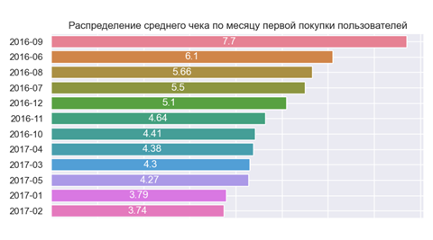
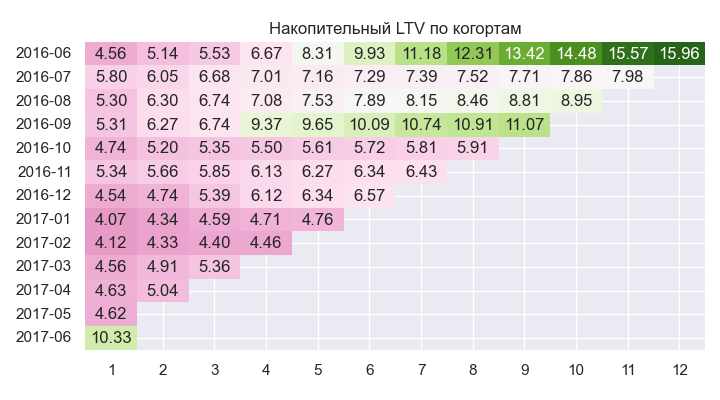

# LTV / когорты / ROI

[Ноутбук](analysis.ipynb) · Учебный кейс · Финансовый сервис

**Стек:** Python, Pandas, NumPy, Seaborn, Matplotlib, Janitor

Нужно было понять, какие когорты и каналы реально приносят деньги — и куда не стоит лить бюджет. Разобрал средний чек, выручку по источникам, накопительный LTV и расходы на привлечение.

## Результат

- Максимальный средний чек — когорта **сент. 2016**, минимальный — **фев. 2017**
- Лучшие каналы по выручке: **контекстная реклама, партнёрская сеть и поисковое продвижение**; заметный рост окт–дек и спад июн–сент (сезонность)
- Наибольший накопительный LTV — когорты **июн. и сент. 2016** — ориентир для похожего привлечения
- Десктоп дороже и объёмнее мобильного; расходы сконцентрированы на **таргетированной рекламе, партнёрской сети и поисковом продвижении**

## Что сделано

1. **Средний чек** по когортам первой покупки
2. **Выручка по каналам** (атрибуция к последнему визиту перед покупкой)
3. **LTV** — средняя и накопительная выручка по когортам
4. **Аномалии** — выбросы чеков и концентрация выручки у небольшой доли пользователей
5. **CAC-взгляд** — расходы на трафик по устройствам и источникам

## Данные

Учебный датасет: `purchases` (buy_ts, uid, revenue) и `visits` (source_id, device, timestamps). Файлы в репозиторий не входят, расчёт и графики сохранены в ноутбуке.

## Вывод

Имеет смысл усиливать **контекстную рекламу, партнёрскую сеть и поисковое продвижение** и когорты с высоким LTV, закладывать сезонность в бюджет и не оценивать десктоп только по стоимости клика — при сильном LTV канал может окупаться.
