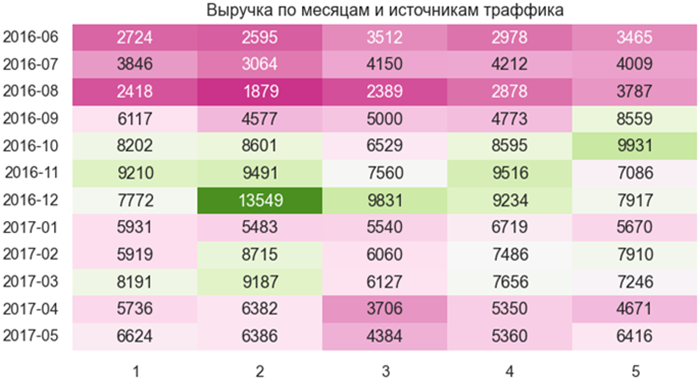

# LTV / когорты / ROI

[Notebook](analysis.ipynb) · финансовый сервис

**Стек:** Python, Pandas, NumPy, Seaborn, Matplotlib, Janitor

Когортный анализ, доход по источникам трафика, LTV и расходы на привлечение.

## Результат

- Максимальный средний чек — когорта **сент. 2016**, минимальный — **фев. 2017**
- Лучшие источники по выручке: **2, 4, 5**; рост выручки окт–дек, спад июн–сент
- Наибольший накопительный LTV — когорты **июн. и сент. 2016**
- Десктоп дороже и объёмнее мобильного; расходы сконцентрированы на источниках **3, 4, 5**

## Что сделано

1. **Средний чек** по когортам первой покупки
2. **Выручка по source_id** (атрибуция к последнему источнику перед покупкой)
3. **LTV** — средняя и накопительная выручка по когортам
4. **Аномалии** — выбросы чеков и концентрация выручки у небольшой доли пользователей
5. **CAC-взгляд** — расходы на трафик по устройствам и источникам

## Данные

`purchases` (buy_ts, uid, revenue) и `visits` (source_id, device, timestamps).

## Вывод

Фокус на каналах 2/4/5 и когортах с высоким LTV; учитывать сезонность в бюджете; десктоп окупается при сильном LTV, но требует контроля затрат.
