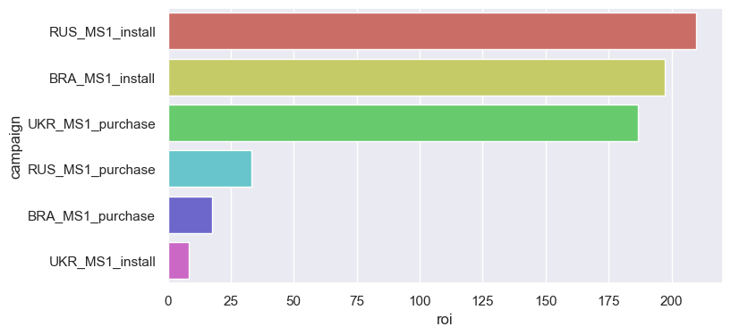
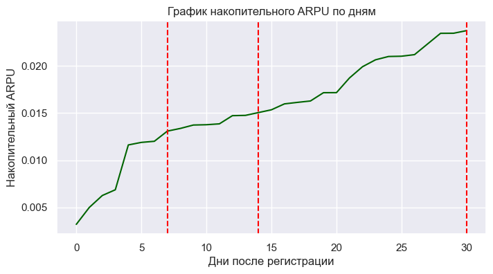
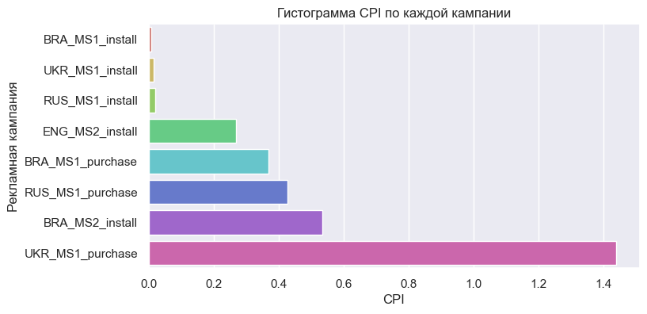

# 🎮Анализ маркетинговых кампаний для игрового сервиса

[Код проекта в jupyter notebook](test.ipynb)

`python` `pandas` `seaborn` `matplotlib` `numpy` `datetime`

## Цель проекта

Провести анализ окупаемости рекламных кампаний, запущенных в январе 2021 года через один из каналов привлечения пользователей. Основной целью данного исследования является определение ключевых показателей, которые позволят оценить эффективность будущих рекламных кампаний и спрогнозировать их окупаемость. Для этого необходимо решить несколько задач:

- Определить оптимальный срок оценки окупаемости рекламных кампаний, чтобы понять, когда можно ожидать возврата инвестиций.
- Выявить наиболее успешные рекламные кампании, типы этих кампаний и рекламные сети на момент оценки окупаемости. Это позволит сосредоточиться на тех инструментах, которые показали наилучшие результаты.
- Рассчитать накопительный ARPU (средний доход на одного пользователя) для успешных рекламных кампаний, ориентированных на покупки, на 7-й, 14-й и 30-й дни существования аккаунта. Эти данные будут использованы для прогнозирования окупаемости новых кампаний.
- Рассчитать фактический показатель CPI (стоимость за установку) для каждой рекламной кампании, чтобы оценить затраты на привлечение каждого нового пользователя.

## Описание проекта

Для выполнения этого исследования использовалось четыре таблицы со следующим содержанием:

- «registrations.csv» – регистрации аккаунтов за январь 2021 год с одного из каналов. Описание данных:
  - account_id – ID аккаунта;
  - created_date – дата создания аккаунта;
  - campaign – рекламная кампания, с которой пришел пользователь
- «payments.csv» – платежи пользователей одного из каналов за 2021 год. Описание данных:
  - payment_date – дата оплаты
  - payment_types – типы платежных систем;
  - real_cost – сконвертированная сумма платежа;
  - account_id - ID аккаунта.
- «persents.csv» – комиссии платежных систем. Описание данных:
  - payment_types – типы платежных систем;
  - Share, %  - комиссия платежной системы.
- «budget_01_21.xlsx» - бюджет на рекламу в январе 2021 года. Описание данных:
  - media_source – рекламная сеть;
  - Campaign_type – тип рекламной кампании;
  - Target – регион, на который направлена рекламная кампания;
  - Plan, USD – планируемый бюджет;
  - Installs – фактическое количество установок;
  - Spend, USD – фактически потраченный бюджет;
  - Deviation, USD – отклонение от плана.

## Результат

### Определение оптимального срока оценки окупаемости рекламных кампаний

По проведенному анализу, оптимальный срок для оценки окупаемости рекламных кампаний составляет 196 дней. При детальном рассмотрении типов кампаний видно, что:

Для кампаний, которые оплачиваются за установку приложения этот срок составляет 160 дней.

Для кампаний с оплатой за совершенные покупки – 231 день.

Также стоит отметить региональные различия:

- Бразилия: 134 дня.

- Россия: 217 дней.

- Украина: 235 дней.

### Определение наиболее успешных рекламных кампаний

**Лучшие рекламные кампании с близким уровнем ROI**:

- RUS_MS1_install: ROI 210

- BRA_MS1_install: ROI 197

- UKR_MS1_purchase: ROI 186

**Тип рекламной кампании с наибольшей эффективностью**:
Рекламные кампании, оплачиваемые за установку приложения, имеют ROI 162, в то время как кампании с оплатой за покупки – 68.

**Лучшая рекламная сеть на основе результатов**:
Рекламная сеть номер один показала прибыльность. Все кампании в рекламной сети номер два не окупились.

### Рассчет накопительного ARPU

Накопительная выручка на одного пользователя по успешным рекламным кампаниям за:

- 7 дней: $0.0120

- 14 дней: $0.0148

- 30 дней: $0.0235

Эти значения помогут в прогнозировании окупаемости новых рекламных кампаний.

### Рассчет фактического CPI

Фактический CPI (cost per install) для каждой рекламной кампании:

| campaign           | CPI      |
|--------------------|----------|
| BRA_MS1_install    | 0.009476 |
| UKR_MS1_install    | 0.015478 |
| RUS_MS1_install    | 0.020708 |
| ENG_MS2_install    | 0.269407 |
| BRA_MS1_purchase   | 0.368797 |
| RUS_MS1_purchase   | 0.428015 |
| BRA_MS2_install    | 0.533882 |
| UKR_MS1_purchase   | 1.438554 |

## Вывод

На основании анализа окупаемости рекламных кампаний за январь 2021 года можно рекомендовать фокусироваться на кампаниях с оплатой за установку приложения, запускать их в успешной рекламной сети номер один и учитывать указанные сроки для максимизации прибыли.
