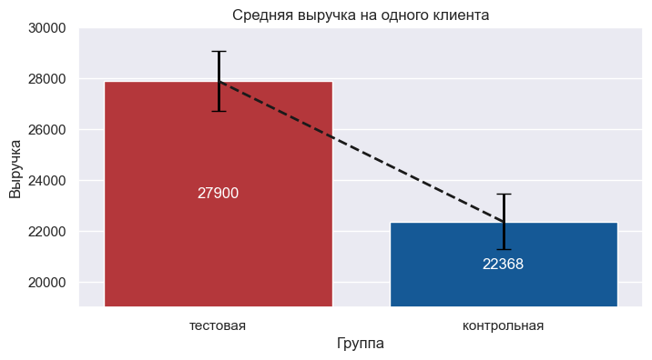
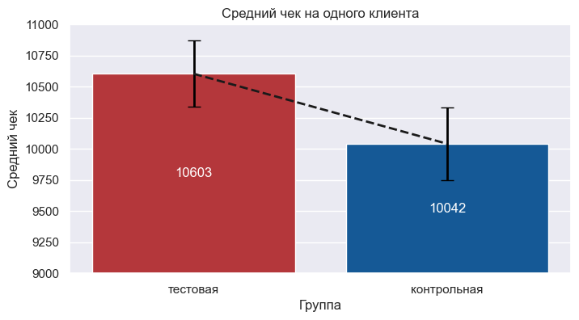
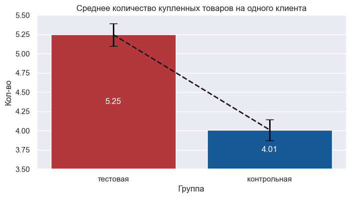

# 🏃‍♀️Оценка А/Б теста и кластеризация для магазина спортивных товаров

[Код проекта в jupyter notebook](research.ipynb)

`python` `pandas` `matplotlib` `scipy` `seaborn` `numpy` `sklearn` `kmodes` `re` `sqlalchemy`

## Цель проекта

C помощью данных о покупках клиентов и их социально-демографических признаках проанализировать эффективность уже проведённых маркетинговых кампаний и выявить факторы, способные повысить продажи.

А именно:

* Провести расчёт A/B-теста и посчитать значения основных метрик. Потом сделать бизнес-рекомендацию и обосновать её.
* Выяснить, на какие кластеры разбивается аудитория, и предложить методы работы с каждым кластером.
* Построить модель склонности клиента к покупке определённого товара при коммуникации, основанную на данных о профилях клиентов, данных товаров и данных о прошлых маркетинговых кампаниях.

## Описание проекта

База данных содержит три таблицы:

* personal_data — ID клиентов, их пол, возраст, образование, страна и город проживания;
* personal_data_coeffs — данные с персональными коэффициентами клиентов, которые рассчитываются по некоторой закрытой схеме (вам потребуется коэффициент personal_coef);
* purchases — данные о покупках: ID покупателя, название товара, цвет, стоимость, гендерная принадлежность потенциальных покупателей товара, наличие скидки (поле base_sale. Значение 1 соответствует наличию скидки на момент покупки) и дата покупки.

При передаче данных выяснилось, что часть информации о клиентах из таблицы personal_data была утеряна. Поэтому, помимо базы данных, предоставлен сжатый CSV-файл с утерянными данными (personal_data.csv.gz). К сожалению, информацию о поле клиентов восстановить не удалось.

Известно, что магазин проводил две маркетинговые кампании:

* Первая кампания проводилась в период с 5-го по 16-й день, ID участвовавших в ней пользователей содержатся в файле ids_first_company_positive.txt. Эта кампания включала в себя предоставление персональной скидки 5 000 клиентов через email-рассылку.
* Вторая кампания проводилась на жителях города 1 134 и представляла собой баннерную рекламу на билбордах: скидка всем каждое 15-е число месяца (15-й и 45-й день в нашем случае).

## Результат

### Оценка А/Б теста

Т.к. распределение не является нормальным, а выборки независимы, использовался критерий Манна-Уитни для проверки гипотезы о среднем.

```python
mann = stats.mannwhitneyu(positive_arpu['cost'], negative_arpu['cost'])
print(mann)

if mann[1] < 0.05:
    print('Есть статистически значимая разница')
else:
    print('Статистически значимой разницы нет')
```

После проверки гипотез были получены следующие результаты:

Есть статистически значимая разница между средней выручкой на одного пользователя в тестовой и контрольной группах
  


Есть статистически значимая разница между средним чеком в тестовой и контрольной группах



Есть статистически значимая разница между количеством купленных товаров на одного клиента за время проведения маркетинговой кампании в тестовой и контрольной группах



Таким образом, в результате проведенной первой маркетинговой компании средняя выручка на одного пользователя в тестовой группе выше на 25% чем в контрольной, средний чек выше на 6% и среднее количество купленных товаров одним клиентом выше на 31%. Из этих результатов можно сделать вывод, что маркетинговая компания была эффективна.

### Кластеризация

В результате кластеризации клиентов были получены следующие данные:

|                               | Кластер 1        | Кластер 2       | Кластер 3            | Кластер 4       |
|:-------------                 |:---------------: |:-------------:  |:-------------:       |:-------------:  |
|Возраст                        | 16               | 39              | 38                   | 41              |
|Сумма расходов                 | 37978            | 28459           | 26590                | 60020           |
|Скидки (да/нет) в %            | 33/67            | 61/39           | 16/84                | 21/79           |
|Максимальная дата покупки (дни)| 40               | 44              | 23                   | 50              |
|Образование (выс/сред) в %     | 80/20            | 20/80           | 20/80                | 14/86           |
|Пол (муж/жен) в %              | 68/32            | 27/73           | 63/37                | 76/24           |
|Наиболее покупаемый товар      |кроссовки мужские |кроссовки женские|кроссовки мужские     |кроссовки мужские|
|Товары для какого пола покупают|мужского          | женского        |универсальные         |мужского         |
|Цвет                           |черный            | черный          | черный               |другой           |
|Доля от всех клиентов в %      |6                 | 30              | 26                   |38               |

**Первый кластер** (6% от общего количества) является самым молодым (средний возраст 16 лет), при этом 80% клиентов в нем имеют высшее образование. Состоит он преимущественно из клиентов мужского пола (68%) со средними расходами на одного клиента в 38 тысяч рублей и покупают они в основном товары предназначенные для мужчин. Наиболее популярным товаром в этой группе являются мужские кроссовки. Данной группе необходимо помочь в выборе товара, дать полезный контент. Как вариант - поздравить с покупкой, пригласить в соцсети, предложить выгодные акции.

**Второй кластер** (30%) состоит преимущественно из женщин (73%) и чаще всех делает покупки при наличии скидки (61%). Самый популярный товар в этой группе женские кроссовки, а цвет - черный. Средняя сумма расходов на одного клиента 28 тысяч рублей. В основном приборетают товары для женщин. Для этого кластера необходимо подготовить программу лояльности, начислить бонусы, предложить скидку или подарок за покупку при достижении определенного уровня чека.

**Третий кластер** (26%) лишь в 16% приобретает товары по скидке, средние расходы самые низкие (26 тысяч рублей) и дольше всех не делал покупок. Преимущественно приобретают универсальные товары. Поскольку данные клиенты дольше всех не взаимодействовали с компанией можно попытаться восстановить контакт с помощью рассылки.

**Четвертый кластер** (38%) имеет самые большие расходы в 60 тысяч рублей, самую позднюю дату покупки. На 76% состоит из мужчин с преимущественно средним образованием (86%) и возрастом в 41 год. Это самые прибыльные и лояльные клиенты. Основной стратегией работы с данным кластером будет демонстрация заинтересованности со стороны компании: статус VIP, персональная карта, подарок, благодарность. Скидки и бонусы не требуются.

### Модель склонности клиента к покупке определенного товара

Общее количество уникальных категорий которые участвовали в обучении модели - 428. Была выбрана модель случайного леса с результатом f1-score 17% на обучающей выборке. После применения модели на тестовой выборке были получены следующие результаты классификации:

| Товар    | Количество |
|----------|----------  |
| Кроссовки| 9865       |
| Брюки    | 2472       |
| Ветровка | 101        |

## Вывод

На основе полученных результатов можно сделать несколько выводов:

1. **Эффективность маркетинговой кампании**. Проведенная первая маркетинговая кампания показала положительные результаты. Средняя выручка на одного пользователя в тестовой группе оказалась на 25% выше, чем в контрольной, средний чек увеличился на 6%, а среднее количество купленных товаров одним клиентом выросло на 31%. Это свидетельствует об эффективности кампании.

2. **Кластеры клиентов**. В ходе кластеризации было выделено четыре группы клиентов с различными характеристиками. Например, клиенты первого кластера отличаются высокой долей мужчин (68%) и предпочитают покупать мужские кроссовки, в то время как второй кластер представлен преимущественно женщинами (73%), предпочитающими женские кроссовки. Четвертый кластер выделяется наибольшей суммой расходов среди других групп. Эти различия могут использоваться для разработки персонализированных предложений и акций.

3. **Модель склонности клиента к покупке**. Несмотря на относительно низкий показатель f1-score (17%), модель смогла предсказать покупку определенных категорий товаров. Наибольшее количество покупок приходится на кроссовки, что подтверждает популярность этого товара среди клиентов. Также стоит отметить, что брюки и ветровки имеют значительно меньший объем продаж, но все же присутствуют в прогнозах модели.

Таким образом, полученные результаты позволяют улучшить понимание поведения клиентов и разработать стратегии для повышения их лояльности и увеличения объема продаж.
