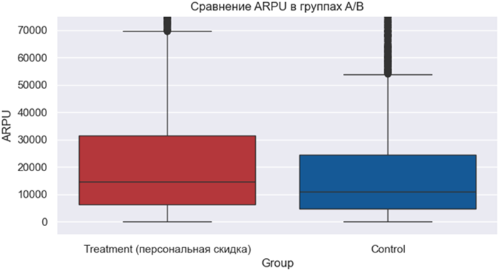
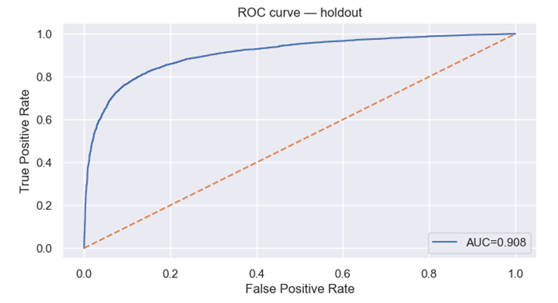

# Анализ маркетинговых кампаний и сегментация покупателей спортивного магазина

[Код проекта в Jupyter Notebook](research.ipynb)

`python` `pandas` `numpy` `matplotlib` `seaborn` `scipy` `scikit-learn` `catboost` `kmodes` `sqlalchemy`

## Цель проекта
По данным о покупках и соц-демографических характеристиках клиентов:

1) оценить эффективность проведённой email-кампании (A/B-тест) и дать бизнес-рекомендацию;  
2) сегментировать аудиторию и предложить подходы к работе с каждым сегментом;  
3) восстановить утерянный признак пола (`gender`);  
4) построить модель склонности к покупке товара (propensity/ранжирование) для поддержки новой кампании.

## Данные
Данные лежат в папке `data/`:

- `shop_database.db` (SQLite) с таблицами:
  - `personal_data` — id клиента, пол, возраст, образование, страна и город;
  - `personal_data_coeffs` — персональные коэффициенты (используется `personal_coef`);
  - `purchases` — покупки: `id`, `product`, `colour`, `cost`, `product_sex`, `base_sale`, `dt`.
- `personal_data.csv.gz` — утерянные строки из `personal_data` (пол отсутствует).
- `ids_first_company_positive.txt` / `ids_first_company_negative.txt` — id клиентов treatment/control для A/B-теста первой кампании.

Перед анализом данные фильтруются: используются только клиенты страны с кодом `32` (как требуется в задании).

## Что сделано в ноутбуке

### 1) Предобработка и сбор витрины
- загрузка таблиц из SQLite и файлов;
- унификация текстовых признаков (наименования товаров, цвета, обработка мульти-цветов);
- объединение профилей клиентов с коэффициентами (`personal_coef`).

### 2) Восстановление пола клиента (классификация)
Так как часть клиентов потеряла `gender`, построена модель на клиентах с известным полом и применена к клиентам с пропусками.

Подход:
- агрегирование поведения из покупок на уровне клиента (количество заказов, сумма/средний чек, доля покупок со скидкой, давность последней покупки, доли покупок по `product_sex`);
- обучение `LogisticRegression` в пайплайне с обработкой числовых и категориальных признаков.

Качество:
- **F1 (holdout) = 0.9467**.

После применения модели пропуски пола устранены.

### 3) A/B-тест первой кампании (персональная скидка по email)
**Кампания:** дни 5–16.  
**Treatment:** клиенты из `ids_first_company_positive.txt` (персональная скидка).  
**Control:** клиенты из `ids_first_company_negative.txt` (скидки не было).

Основная метрика: **ARPU** (выручка на клиента) в окне кампании.

Статистика:
- используется **Welch t-test** для проверки гипотезы `ARPU_treat > ARPU_ctrl`;
- применена проверка корректности t-test через **Монте-Карло** (10 000 случайных разбиений) — p-values близки к равномерному распределению.

Результат по ARPU:
- **ARPU_treat = 26 573.12**
- **ARPU_ctrl  = 22 270.58**
- **Δ = 4 302.54 (lift = 19.32%)**
- **t-stat = 5.339**
- **p-value < 1e-6**
- **95% CI разницы: [2 723.01; 5 882.06]**

**Вывод:** персональная скидка статистически значимо увеличила ARPU, кампания была успешной.

### 4) Кластеризация клиентов
Сегментация выполнена методом **K-Prototypes** (смешанные числовые и категориальные признаки), выбрано **4 кластера**.

Краткие профили и рекомендации:

#### Кластер 1 (38%)
- Самый крупный сегмент.  
- Средний возраст — **41 год**.  
- Высокие расходы (≈ **60 тыс. руб.** на клиента).  
- 77% мужчин, чаще покупают *мужские кроссовки* (разных цветов).  
- Низкая чувствительность к скидкам (**21%**).  
- Преимущественно высшее образование (0.86).  
💡 Зрелая и платёжеспособная аудитория, ценящая товар, а не скидку.  
**Стратегия:** премиальные предложения и персонализированные кампании.

#### Кластер 2 (6%)
- Самый молодой сегмент (≈ **15 лет**).  
- Расходы выше среднего (≈ **38 тыс. руб.**).  
- 68% мужчин, чаще покупают *мужские кроссовки* (преимущественно чёрные).  
- Чувствительность к скидкам средняя (**33%**).  
- Преимущественно среднее образование (0.18).  
💡 Подростки и студенты.  
**Стратегия:** массовые промо-акции, скидки, визуально яркий маркетинг.

#### Кластер 3 (30%)
- Средний возраст — **39 лет**.  
- Основная группа женщин (**74%**).  
- Самая высокая чувствительность к скидкам (**60%**).  
- Средние расходы (≈ **28.6 тыс. руб.**).  
- Популярный товар — *женские кроссовки*, чаще чёрные.  
- Преимущественно высшее образование (0.81).  
💡 Женская аудитория среднего возраста, активно реагирующая на акции.  
**Стратегия:** e-mail и push-маркетинг со скидками, программы лояльности.

#### Кластер 4 (26%)
- Средний возраст — **38 лет**.  
- Самые низкие расходы (≈ **26 тыс. руб.**).  
- 64% мужчин.  
- Чаще покупают *мужские кроссовки* (чёрного цвета).  
- Слабо реагируют на скидки (**17%**).  
- Минимальная давность покупок (dt_max = 23).  
- Преимущественно высшее образование (0.79).  
💡 Мужчины со средней активностью.  
**Стратегия:** бонусные программы, кросс-маркетинг («товар + аксессуар»), нематериальные стимулы.

### 5) Модель склонности к покупке товара (propensity / ранжирование)
Постановка: модель для пар **(клиент, товар)**.

Формирование обучающих примеров:
- **y=1**: клиент купил товар в рамках кампаний (email + баннер);
- **y=0**: для тех же клиентов выбираются товары из «пула кампаний», которые клиент не покупал (negative sampling, 3 негатива на позитив).

Особенность: из-за negative sampling `predict_proba` интерпретируется как **скор для ранжирования** (top-N, gain/lift), а не как «истинная вероятность покупки».

Модель:
- `CatBoostClassifier` (категориальные признаки подаются нативно);
- разбиение train/holdout и CV выполнены **по группам `id`** (GroupShuffleSplit + GroupKFold), чтобы исключить утечку по клиенту;
- подбор гиперпараметров: `RandomizedSearchCV` (10 итераций).

Качество:
- размер датасета пар: **58 788** строк;
- **CV ROC-AUC = 0.9078**
- **Holdout ROC-AUC = 0.9081**
- **Holdout AP = 0.9114**

#### Как работает модель
На вход модель получает признаки клиента (возраст, образование, город, персональный коэффициент и т.д.) и признаки товара (цена, популярность, доля скидочных покупок, целевая аудитория товара, типичный цвет), а также интеракцию `sex_match` (насколько товар “подходит” полу клиента).  
На выходе `CatBoostClassifier` возвращает `score` — оценку привлекательности **конкретной пары (клиент, товар)**. Чем выше `score`, тем выше ожидаемая склонность клиента купить этот товар при коммуникации.

На практике модель используется так:
1) выбираем товар для промо;  
2) формируем строки (клиент из целевой аудитории, выбранный товар);  
3) считаем `score` для всех клиентов;  
4) берём top-N клиентов с максимальным `score` для рассылки/таргетинга.